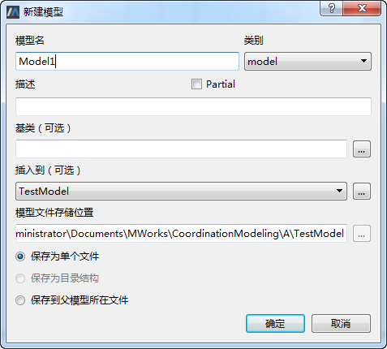
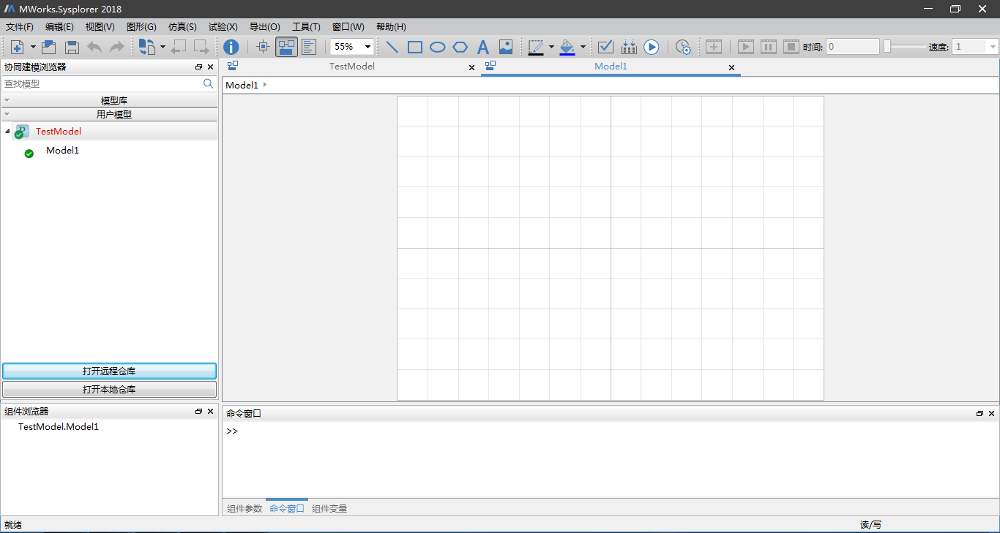
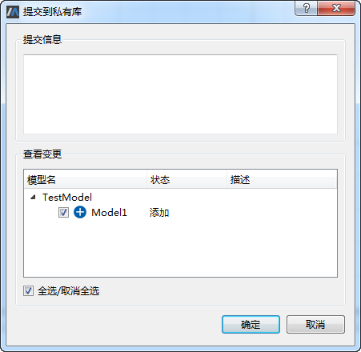
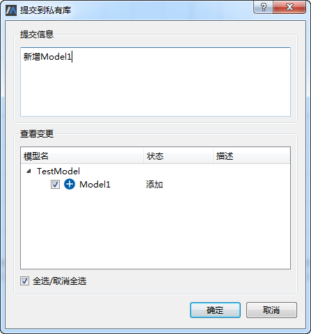

# 本地提交

用户在本地仓库中新增或者修改、删除已有模型时，执行本地提交操作，将所做修改提交至私有库。

以用户A本地模型库TestModel中新增模型Model1的本地提交为例，在左侧协同建模浏览器中鼠标右键单击“TestModel”节点，选择“在TestModel中新建模型”菜单，弹出“新建模型”对话框。

在“新建模型”对话框中，设置新建模型的模型名、类别、描述、基类、插入到位置、保存类型以及是否为Partial，这里我们均保持默认，点击“确定”按钮，TestModel下新增一模型Model1节点。

模型库保存后接着鼠标右键单击TestModel中任意节点选择“本地提交”菜单，弹出“提交到私有库”对话框，其由“提交信息”项和“查看变更”项两部分组成。“查看变更”项中列出了本地仓库中所有状态为deleted，modified和untracked（未受控）的模型。

在“查看变更”项中勾选/取消勾选需要提交到私有库的变更项，这里默认全部勾选，接着在“提交信息”项中输入“新增模型Model1”，点击“确定”按钮，将勾选的变更提交到私有库。

