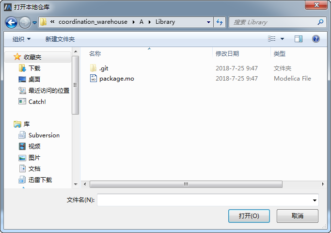
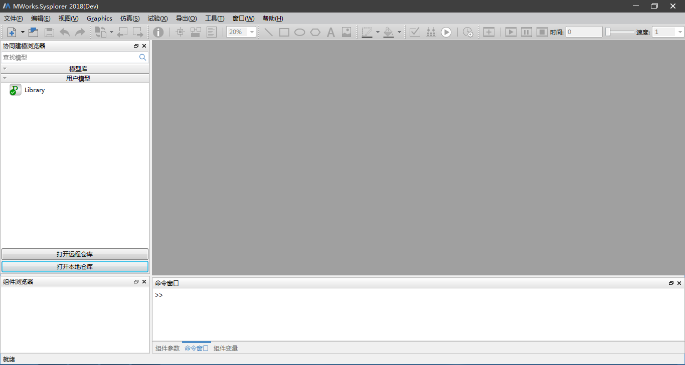
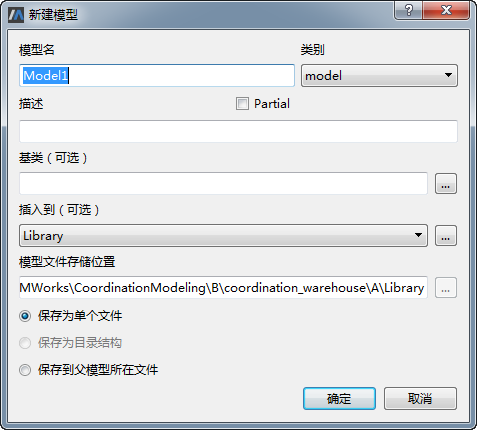
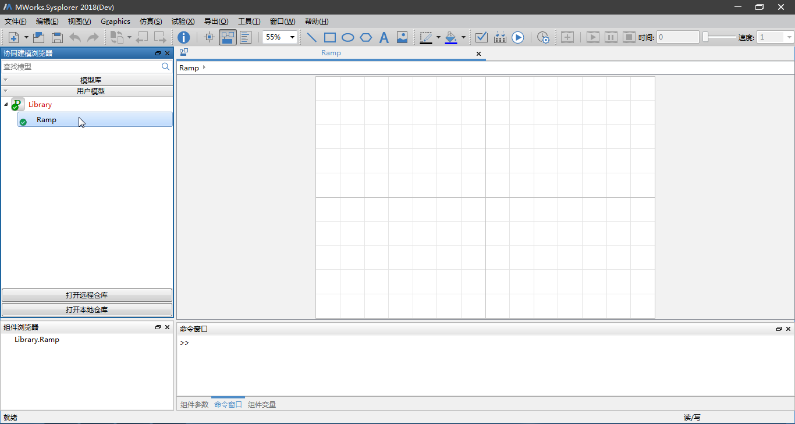
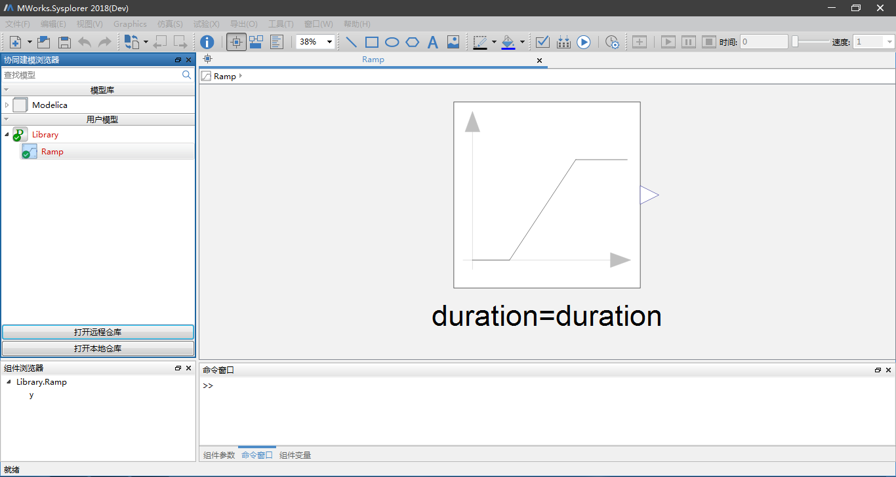
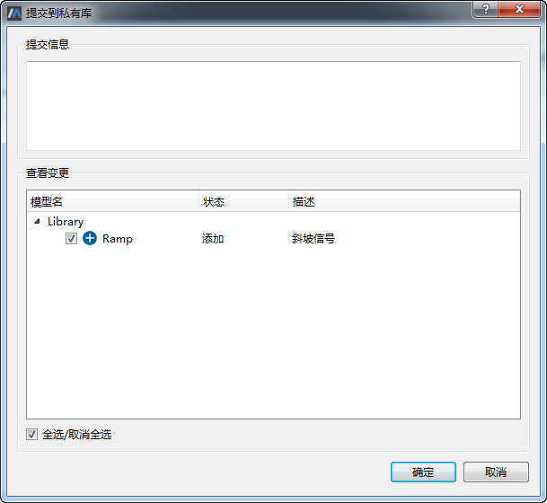
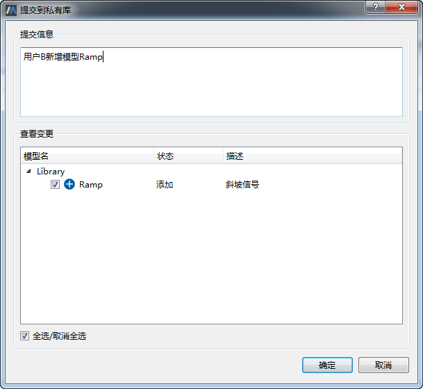
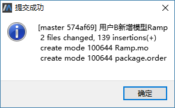

# 本地提交

用户在本地仓库中新增或者修改、删除已有模型时，执行本地提交操作，将所做修改提交至私有库。

以用户B新建模型“Ramp”的本地提交为例。用户B克隆远程仓库“Library”完成后自动将其打开，也可以通过点击“打开本地仓库”按钮，在弹出的“打开本地仓库”对话框中鼠标左键双击本地仓库“Library”进入子目录。

选择“package.mo”文件，点击“打开”按钮打开本地仓库“Library”。

接着在左侧协同建模浏览器中选中“Library”节点，单击鼠标右键选择“在Library中新建模型”菜单，弹出“新建模型”对话框。

在“新建模型”对话框中设置新建模型的模型名、类别、描述、基类、插入到位置、保存类型以及是否为Partial，这里设置模型名为“Ramp”，其他项均保持默认，点击“确定”按钮，“Library”节点下新增一模型“Ramp”。

接着用户B开始制作模型“Ramp”，最终效果如下。

模型“Ramp”制作过程中，若要将所做修改提交到本地仓库，则在左侧协同建模浏览器中选中“Library”中任意节点，接着单击鼠标右键选择“本地提交”菜单，弹出“提交到私有库”对话框。

“提交到私有库”对话框由“提交信息”项和“查看变更”项两部分组成。“查看变更”项中列出了本地仓库中所有状态为删除、修改和添加的模型。

在“查看变更”项中勾选/取消勾选需要提交到私有库的变更项，这里默认全部勾选，接着在“提交信息”项中输入“用户B新增模型Ramp”，如下图所示。

点击“确定”按钮，将勾选的变更项提交到私有库，且提示用户提示成功。

