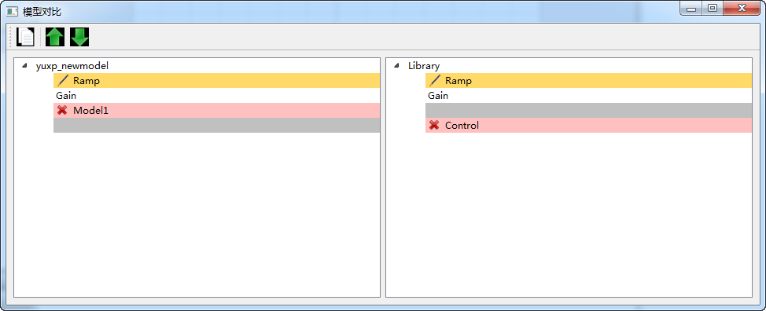
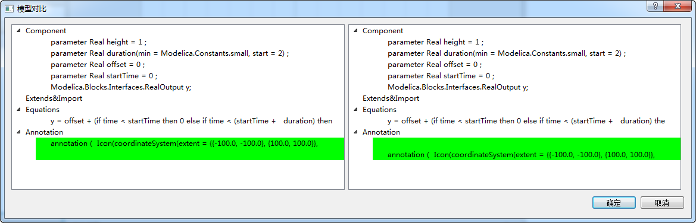
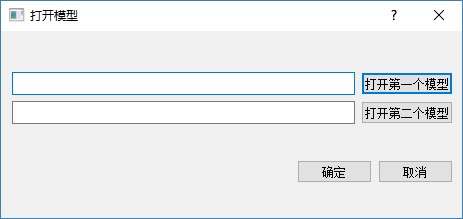

# 模型比对

在左侧协同建模浏览器中选中“Library”中任意节点，接着单击鼠标右键选择“模型比对”菜单，弹出“模型对比”对话框。

在“模型对比”对话框中，可以看到当前仓库与初始克隆时的仓库的比对结果。点击“↑”或者“↓”按钮，定位到上一个不同或者下一个不同。

双击一模型节点，可以看到选中模型的组件、方程和注解等比对的详细结果信息。

系统支持用户对任意两个模型进行比较。点击“打开对比模型文件”按钮，在弹出的“打开模型”对话框中依次点击“打开第一个模型”和“打开第二个模型”按钮选择待比较的两个模型，点击“确定”按钮即可。

