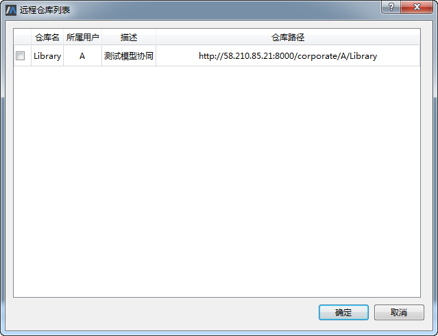

# 克隆远程仓库

## 准备工作

启动SysLink客户端MWorks，确保当前处于协同模式。若当前处于单机模式，则点击菜单“工具→选项”，弹出“选项”对话框。

切换至“Ssylink→Git”，在右侧“模式切换”项中点击“协同模式”即可。

## 克隆远程库

点击左侧协同建模浏览器中的“打开远程仓库”按钮，弹出“登录”对话框。

在“登录”对话框中输入用户名和密码，接着点击“确定”按钮，提示 登录成功。

点击“确定”按钮，弹出“远程仓库列表”对话框，其中列出了当前用户未克隆的所有仓库和协作仓库。

勾选一仓库如“Library”，点击“确定”按钮，开始克隆选择的仓库。

克隆完成后，点击“确定”按钮，MWorks自动加载显示克隆至本地的仓库“Library”，接着用户就可以在当前仓库中进行模型协同操作了。

点击“打开本地仓库”按钮，弹出“打开本地仓库”对话框，可以看到当前用户所有的本地仓库和协作仓库。

双击“coordination\_warehouse”进入子目录，可以看到克隆至本地的仓库“Library”。

