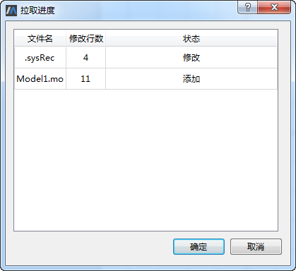
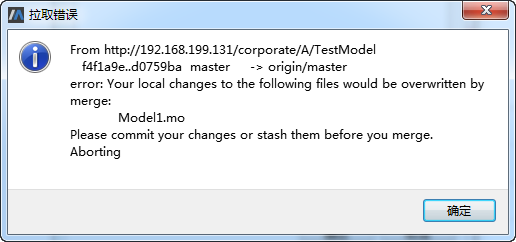

# 拉取

这里，用户A和B在新建仓库后均进行了克隆，且用户A编辑Model1后推送至服务器，此时用户B进行拉取操作。鼠标右键单击左侧协同建模浏览器中模型库TestModel中的任意节点选择“拉取”菜单，弹出“拉取进度”对话框。

“拉取进度”对话框中列出了变更文件列表，点击“确定”按钮获取最新版本的模型库。

拉取时若发生文件合并冲突，则弹出“拉取错误”对话框，此时自行检查、编辑文件内容进行解决后再进行拉取。

