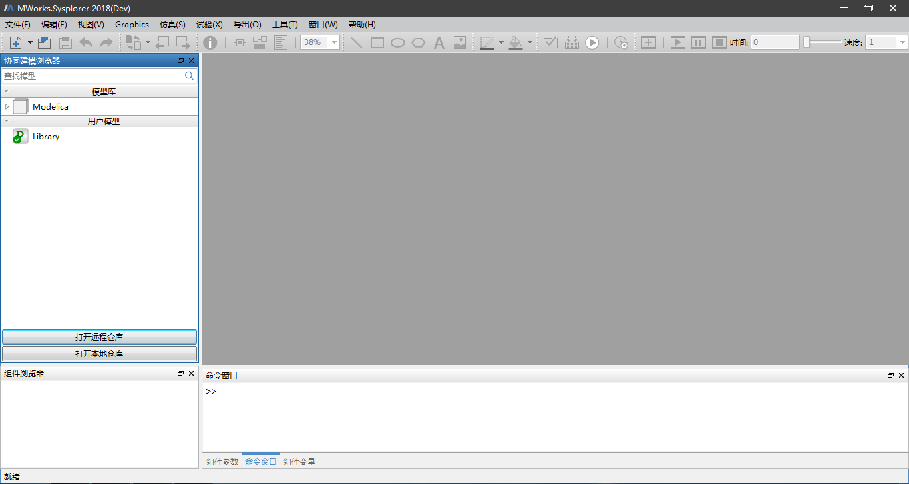
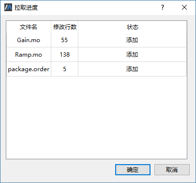
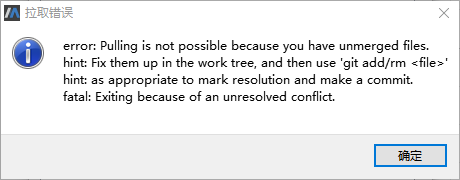
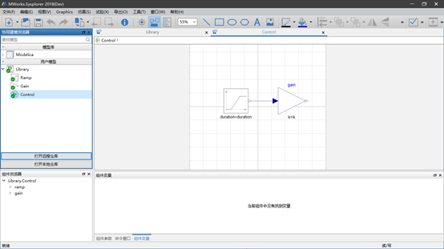

# 拉取

这里以用户B和C在模型新建完成且均推送至服务器，此时用户A进行拉取操作为例。用户A克隆远程仓库“Library”完成后自动将其打开，或者通过点击“打开本地仓库”按钮打开本地仓库“Library”。

在左侧协同建模浏览器中选中“Library”中任意节点，接着单击鼠标右键选择“拉取”菜单，弹出“拉取进度”对话框。

“拉取进度”对话框中列出了变更文件列表，点击“确定”按钮获取最新版本的仓库。

拉取时若发生文件合并冲突，则弹出“拉取错误”提示框，此时自行检查、编辑文件内容进行解决后再进行拉取。

用户C拉取远程仓库“Library”完成后，将模型“Ramp”和“Gain”组合为一个新的模型“Control”，且推送至远程服务器。

