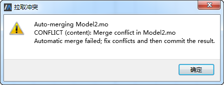
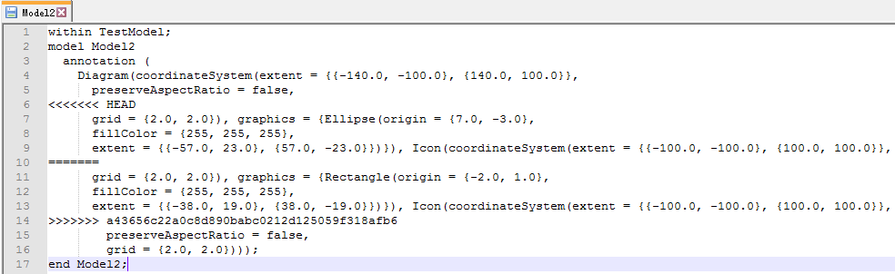

# 推送到服务器

以用户A本地模型库TestModel中编辑模型Model1推送到服务器为例，用户A新增模型Model1进行本地提交后，对Model1进行编辑。

接着鼠标右键单击TestModel中的任意节点选择“推送到服务器”菜单，过一会提示“推送成功”。

推送到服务器之前会默认进行拉取和本地提交操作，再将所做修改提交至远程服务器。

若在用户A推送至服务器之前用户B对TestModel进行了编辑且已推送至服务器，接着用户A编辑TestModel且与用户B存在冲突，则当用户A进行推送至服务器时，首先会进行拉取，提示拉取冲突。

点击“确定”按钮，在弹出的冲突文件中首先解决冲突，再进行推送至服务器。

