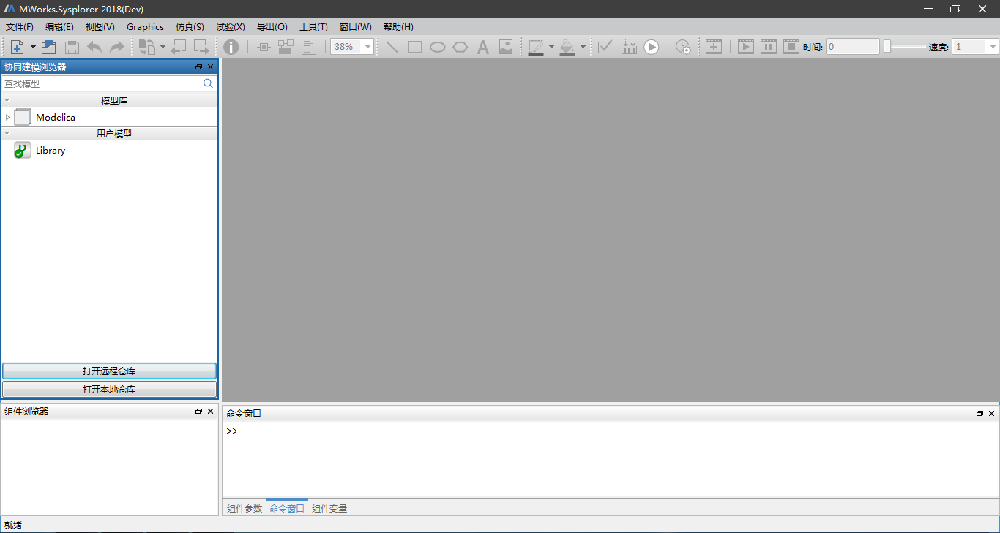
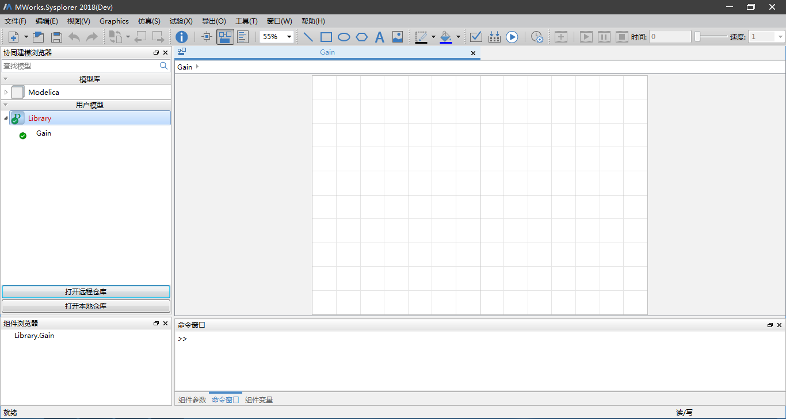
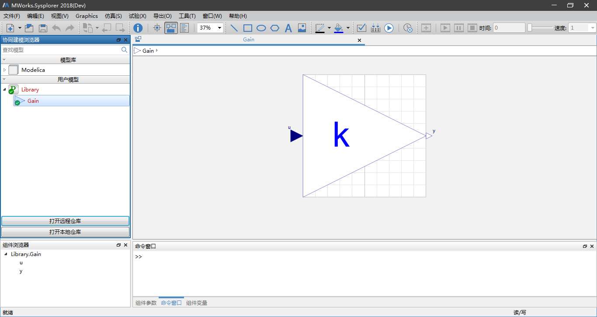
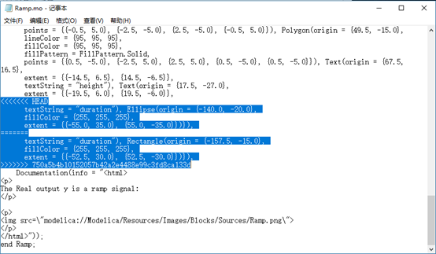

# 推送到服务器

这里以用户C在本地仓库“Library”中新建模型“Gain”推送到服务器为例，用户C克隆远程仓库“Library”完成后自动将其打开，或者通过点击“打开本地仓库”按钮打开本地仓库“Library”。

在左侧协同建模浏览器中选中“Library”节点下新建一模型“Gain”，如下图所示。

接着用户C开始制作模型“Gain”，最终效果如下。

模型“Gain”制作过程中，若要将所做修改提交到远程仓库，则在左侧协同建模浏览器中选中“Library”中任意节点，接着单击鼠标右键选择“推送到服务器”菜单，在弹出的“推送进度”对话框中查看推送至远程仓库的进度信息。

推送到服务器之前会默认进行本地提交和拉取操作，再将所做修改提交至远程服务器。

若在用户C推送至服务器之前其他协作者对模型“Gain”进行了编辑且已推送至服务器，接着用户C编辑模型“Gain”且与其他协作者的存在冲突，则当用户C进行推送至服务器操作时，首先会进行拉取，弹出拉取时存在冲突的模型文件。

用户首先解决冲突，再进行推送至服务器。

