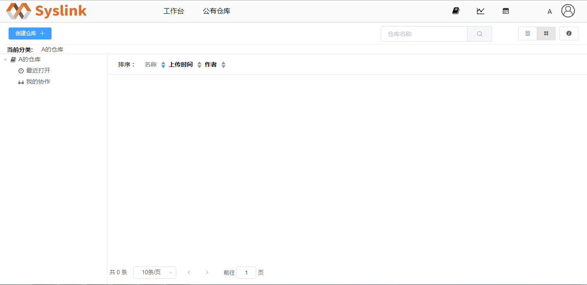
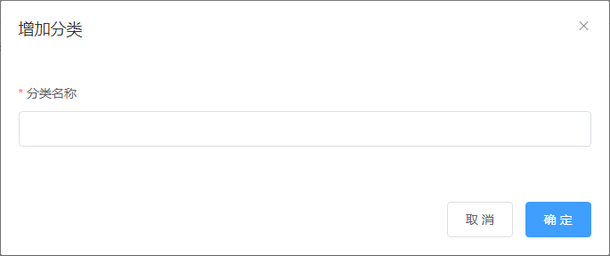

# 新建仓库

用户A登录SysLink web端后，当前页面为我的工作台。

点击右侧“我的仓库”或者右上方的“仓库”按钮，进入“我的仓库”页面，此时左侧仓库分类和右侧仓库列表均为空。

创建仓库前必须创建仓库分类，鼠标光标移至左侧仓库分类树的根节点“A的仓库”上，显示仓库分类工具栏。

点击“+”按钮，弹出“增加分类”对话框。

在“增加分类”对话框中输入分类名称，这里以“控制”为例，点击“确定”按钮，左侧仓库分类树上新增一节点“控制”。

接着选中一仓库分类节点如新增的“控制”，点击“创建仓库”按钮，弹出“创建仓库”对话框。

在“创建仓库”对话框中设置仓库名称和描述信息，这里仓库名称设为“Library”，描述信息为“测试模型协同”。

点击“提交”按钮，新增一仓库“Library ”且进入该仓库的详细信息页面。

