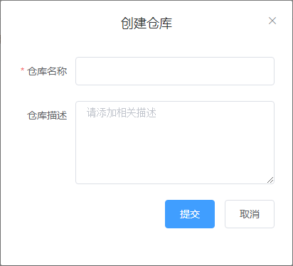

# 新建仓库

用户A登录SysLink后，点击菜单“我的仓库”，进入“我的仓库”页面，此时左侧仓库分类和右侧仓库列表均为空。

首先需要创建仓库分类，鼠标移至左侧仓库分类树的根节点“A的仓库”上，显示仓库分类工具栏。

点击“+”按钮，弹出“增加分类”对话框。

在“增加分类”对话框中输入分类名称如“Modelica模型”，点击“确定”按钮，左侧仓库分类树上新增一节点。

选中一仓库分类节点如新增的“Modelica模型”，点击“创建仓库”按钮，弹出“创建仓库”对话框。

在“创建仓库”对话框中设置仓库名称和描述，这里仓库名称输入为“TestModel”，点击“提交”按钮，新增一仓库“TestModel”且进入该仓库的详细信息页面。

