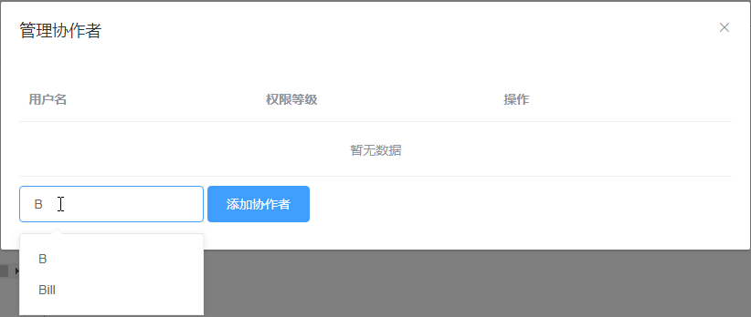
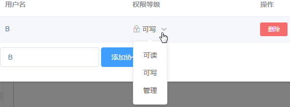
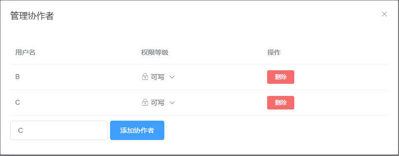

# 添加协作者

新建仓库完成后，在仓库详细信息页面的右侧点击“协作者”按钮，弹出“管理协作者”对话框，当前不存在协作者。

在用户搜索框中输入协作者的用户名，这里以用户B为例，下方显示出包含“B”的所有用户名。

选择用户B，接着点击“添加协作者”按钮，则成功将用户“B”添加为当前仓库的协作者，且默认权限为“可写权限”。

用户B登录SysLink web端后，在我的工作台右下角的“仓库→协同” 项或者“我的仓库”页面的“我的协作”项下可以看到其作为协作者参与的仓库“Library ”。

若要更改协作者的权限，则点击“权限等级”项的下拉按钮，在弹出的权限等级下拉框中选择其他项即可。

接着按照添加用户B为协作者的方法，添加用户C为协作者。

若要删除协作者，则点击“删除”按钮，在弹出的是否删除协作者的提示框中点击“确定”按钮，将当前选中的协作者“B”删除。

