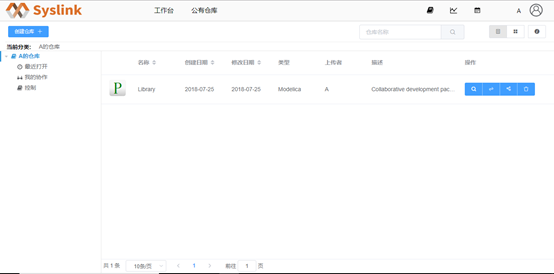
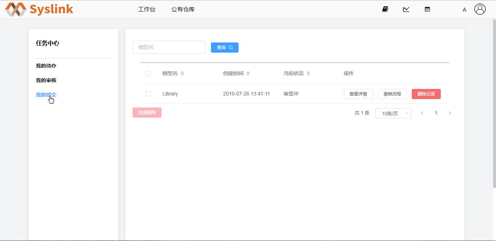
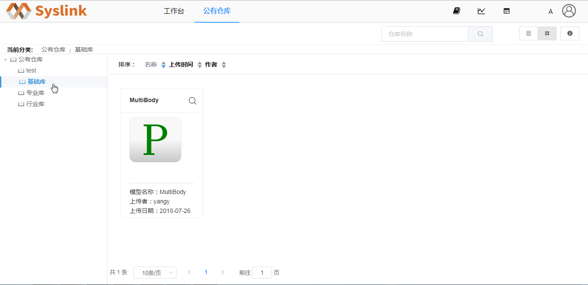

# 发布仓库

在用户A “我的仓库”页面，切换至列表视图。

选中仓库“Library”，接着点击“操作”列中的“发布”按钮，弹出“发布模型”对话框。

展开“公有仓库”节点，接着选中一公有仓库分类如“基础库”。

点击“确定”按钮，接着点击右上方的“任务”按钮，进入“任务中心”页面，当前为“我的待办”页面。

点击左侧“我的提交”项，可以在右侧查看当前用户提交的审批流程信息。

审核通过后，在“公有仓库”页面的“基础库”分类下可以看到发布的仓库“Library”。

