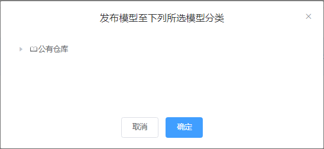
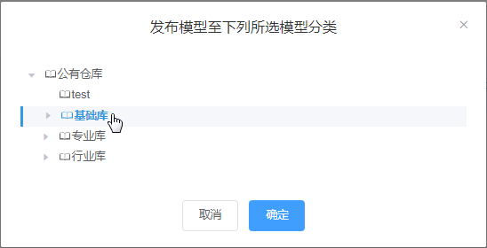
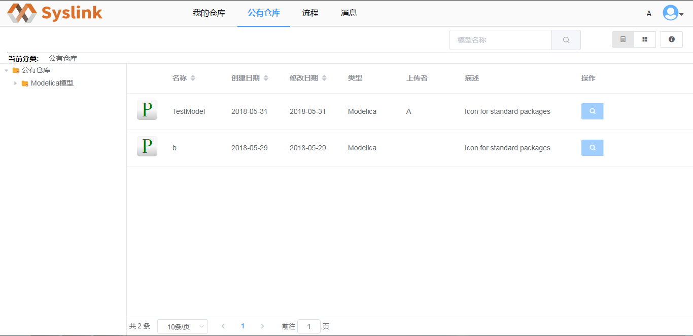

# 发布仓库

在“我的仓库”页面选中仓库“TestModel”，点击“发布”按钮，弹出“发布模型至公有仓库”对话框。

选中一公有仓库分类如“Modelica模型”，点击“确定”按钮，接着点击“流程”菜单，点击左侧“我的流程→我的提交”项，可以在右侧查看当前用户提交的审批流程信息。

审核通过后，在“公有仓库”页面的“Modelica模型”分类下可以看到发布的仓库“TestModel”。

