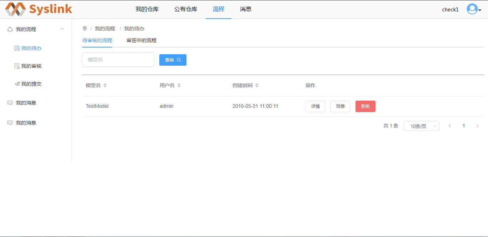
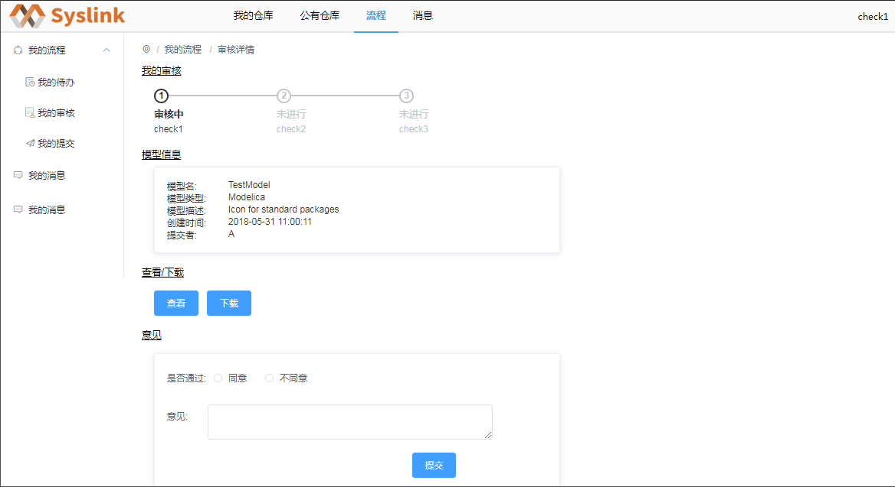
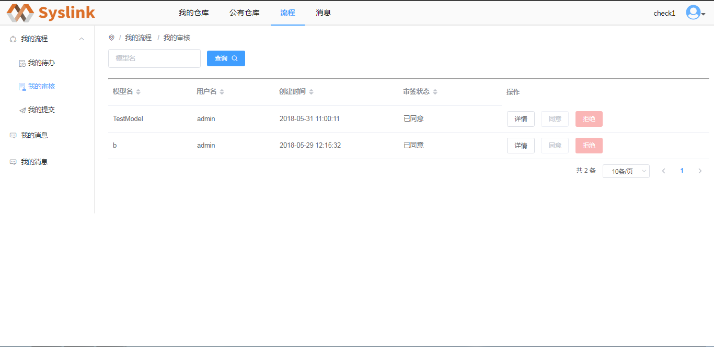

# 流程审批

审核者登录SysLink web端后，点击右侧“我的任务”或者右上方的“任务”按钮，进入“任务中心”页面。当前为“我的待办”页面，在右侧查看当前用户待审核的流程。

选中一待审核的流程，接着点击“操作”列对应的“详情”按钮，进入“审核详情”页面。

审核者可以点击“查看”按钮，查看模型的详细信息；点击“下载”按钮将模型下载至本地。接着在“意见区”输入审批意见，点击“同意”或者“拒绝”按钮，点击“提交”按钮上传审批结果。

审核者也可以在待审核的流程中选中一记录，接着点击“操作”列对应的“同意”或者“拒绝”按钮进行审批。

审批完成后，点击“我的审核”项，进入“我的审核”页面，如下图所示，查看当前审核者已审核的所有流程列表。

