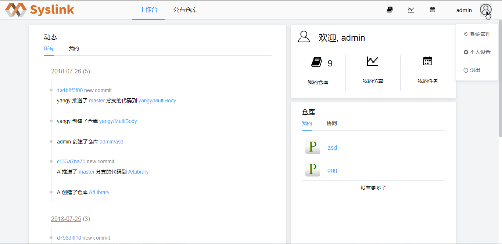
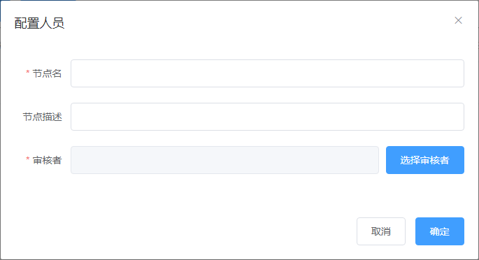

# 审签模板管理

## 新增模板

用户登录SysLink web端后，点击右上角图标，弹出下拉菜单。

点击“系统管理”菜单，进入“系统管理”页面。接着点击左侧的“模板管理”项，进入“模板管理”页面。

系统默认存在一模板“默认模板”，点击“配置”按钮，进入“审核人员配置”页面，可以查看默认模板各节点的人员配置情况。

返回至“模板管理”页面中点击“新增”按钮，弹出“新增”对话框。

在“新增”对话框中设置新增模板的模板名、描述信息和是否为默认模板，这里设置模板名为“发布仓库审批”，其他项默认。

点击“提交”按钮，提示新增模板成功，在模板列表中可以看到新增的模板信息。

新增模板时若“是否为默认模板”为“是”，则点击“提交”按钮后，弹出是否替换默认模板的提示框，如下图所示。

点击“确定”按钮，新增一模板“发布仓库审批”且为当前默认模板，否则取消替换当前默认模板的操作。

## 模板配置

对选中流程模板的各节点和审核者进行配置。

模板列表中选中一模板如新增的模板“发布仓库审批”，接着点击“配置”按钮，进入“审核人员配置”页面，当前模板的审核人员配置显示为空。

接着点击“新增”按钮，弹出“配置人员”对话框。

在“配置人员”对话框中设置节点名、节点描述和审核者，这里设置节点名为“校对”，点击“选择审核者”按钮，弹出“选择人员”对话框。

在选择人员对话框中勾选一审核人员如“check1”，点击“确认”按钮，回到“配置人员”对话框。

点击“确定”按钮，“审核人员配置”页面新增一节点“校对”，用户可以按照新增“校对”节点的方法新增其他审批节点。

系统支持用户对审批节点进行修改和删除操作。选中一审批节点，接着点击“修改”按钮，弹出“配置人员”对话框。

在“配置人员”对话框中，重新设置节点名、描述和审核者，点击“确定”按钮即可。

若要删除一节点，则选中待删除的节点后点击“删除”按钮，弹出删除确认的提示框。

点击“确定”按钮，将选中的节点删除；若点击“取消”按钮，则取消对选中目标的删除操作。

审核人员配置完成后，点击“完成”按钮，弹出提交确认的提示框。

点击“确定”按钮，完成选中模板的配置；若点击“取消”按钮，则取消模板配置的提交操作。

## 设为默认

将当前的模板设为默认模板，当流程发起时根据默认模板的配置进行流转审签。

系统初始存在一默认模板“默认模板”，支持新建时设为默认模板，也支持自定义默认模板。模板列表中选中一已配置的模板如“发布仓库审批”，接着点击“操作”列对应的“设为默认”按钮，弹出是否替换默认模板的确认框。

点击“确定”按钮，将当前选中的模板设置为默认模板；点击“取消”按钮，则取消将选中的模板设为默认。

## 删除模板

在“模板管理”页面的模板列表中选中一模板，接着点击“删除”按钮，弹出是否删除的提示框。

点击“确定”按钮，将选中的模板删除；若点击“取消”按钮，则取消对选中目标的删除操作。用户也可以勾选若干模板，点击“批量删除”按钮实现多个模板的删除操作。

