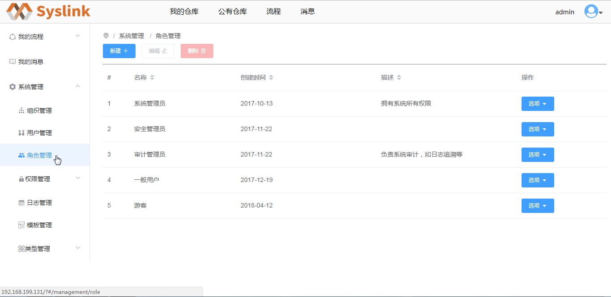
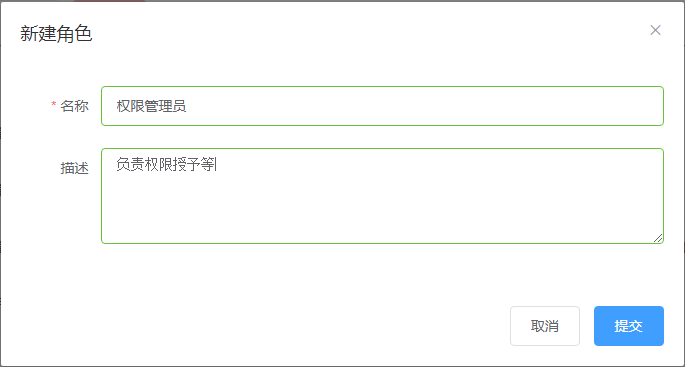

# 角色管理

## 创建角色

在展开的“系统管理”项中点击“角色管理”项，进入“角色管理”页面，可以在右侧可以查看系统的角色列表信息。

接着点击“新建”按钮，弹出“新建角色”对话框。

在“新建角色”对话框中设置角色名称和描述等信息，这里设置角色名称如为“权限管理员”，“描述”为“负责权限授予等”。

点击“提交”按钮，提示创建角色成功，在系统角色列表中可看到新创建的角色信息。

## 编辑角色

在系统角色列表中选中一个角色如新建的“权限管理员”，接着点击“编辑”按钮，弹出“编辑角色”对话框。

在“编辑角色”对话框中修改选中角色的名称和描述等信息，如这里将描述信息设置为“负责角色和用户的权限授予等”。

点击“提交”按钮，提示编辑系统角色成功，接着在角色列表中可看到编辑后的角色信息。

## 删除角色

在系统角色列表中选中一个角色如新建的“权限管理员”，接着点击“删除”按钮，弹出是否删除角色的确认框。

点击“确认”按钮，删除选中的角色；点击“取消”按钮，取消角色的删除操作。

## 编辑角色权限

在角色列表中选中一角色如新建的“权限管理员”，接着点击“操作”列对应的“分配权限”按钮，弹出“分配权限”对话框。在“分配权限”对话框中勾选/取消勾选一权限，则选中角色拥有或者取消拥有该权限。

## 目录控制

设置系统角色对公有仓库分类目录的控制权限，包括可读、读/写和管理。若为“可读”，则仅允许系统角色对公有仓库分类目录下的仓库进行查看操作；若为“读/写”，则在“可读”的基础上新增移动操作；若为“管理”，则在“读/写”的基础上新增删除操作。

在角色列表中选中一角色，这里仍以新建的“权限管理员”为例。在“操作”列对应的“选项”下拉菜单中选择“目录控制”，弹出“目录控制”对话框。

在“目录控制”对话框中设置选中角色对公有模型分类目录的控制权限，接着点击“提交”按钮即可。

