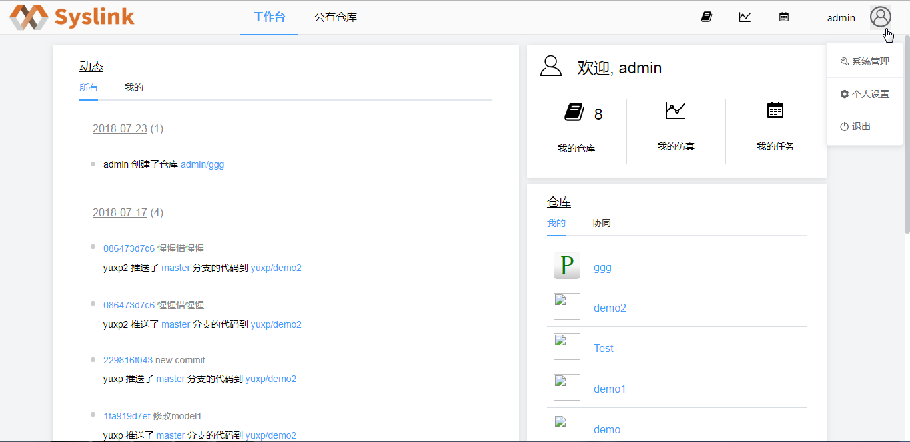
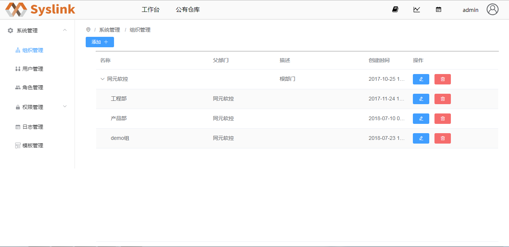
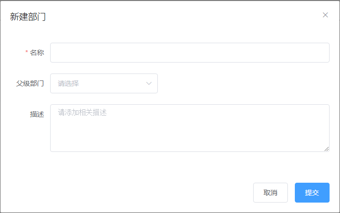
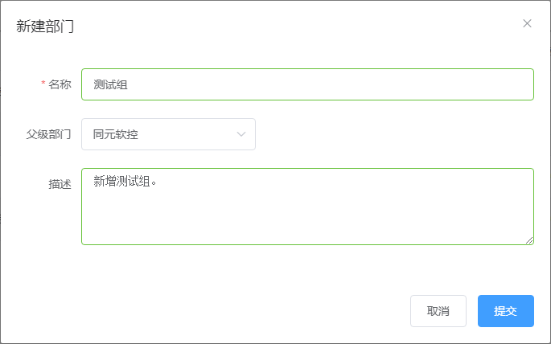
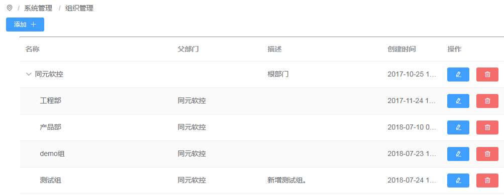
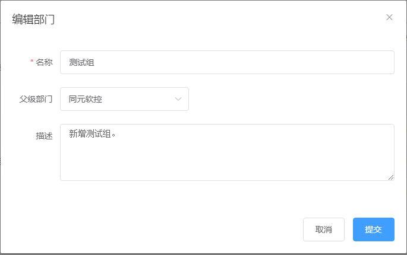
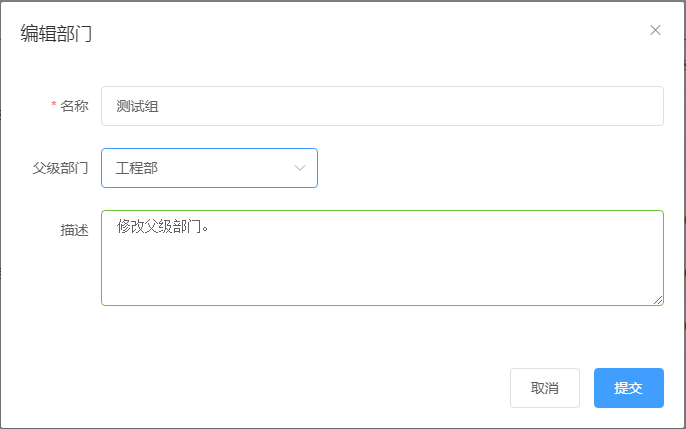
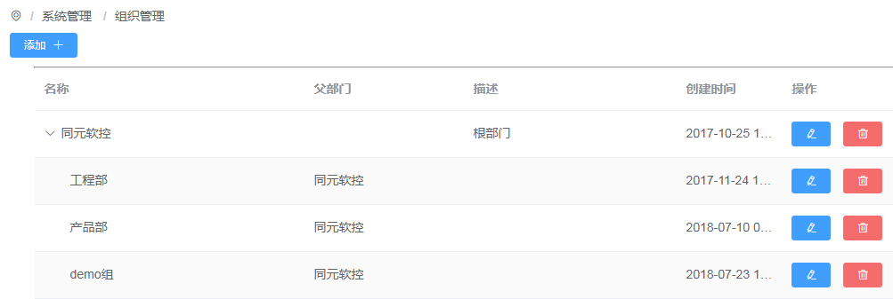

# 部门管理

## 新建部门

系统管理员登录SysLink web端后，点击右上角图标，弹出下拉菜单。

点击“系统管理”菜单，进入到“系统管理”页面。当前为“组织管理”页面，可以在右侧查看组织列表信息。

点击“添加”按钮，弹出“新建部门”对话框，如下图所示。

在“新建部门”对话框中设置部门的名称、父级部门和描述信息，这里设置名称为“测试组”，“父级部门”为“同元软控”，“描述信息”为“新增测试组”。

点击“提交”按钮，在部门列表中可查看到新创建的部门“测试组”。

## 编辑部门

在部门列表中选中一个部门如新建的“测试组”，接着点击“编辑”按钮，弹出“编辑部门”对话框。

在“编辑部门”对话框中编辑部门名称、父级部门和描述信息，这里修改“父级部门”为“工程部”，“描述”为“修改父级部门”。

点击“提交”按钮，在部门列表中可查看到编辑后的部门“测试组”。

## 删除部门

在部门列表中，选中一个部门如编辑后的“测试组”，点击“删除”按钮，弹出删除部门的提示框。

点击“确定“按钮，选中的部门从部门列表中删除。若部门中存在人员，则随着部门也一并删除。

若删除的部门为父级部门，则其隶属部门及隶属部门人员也将删除。其中，根部门为系统默认部门，不允许被删除。

