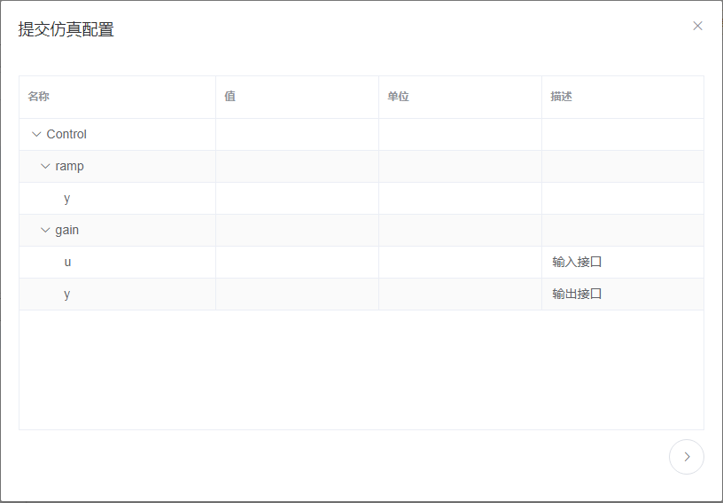

# 在线仿真

系统支持模型的在线仿真，以用户A对仓库“Library”中的模型“Control”（由用户A组合完成且推送至远程服务器）进行在线仿真为例。

在用户A“我的仓库”页面，选中一仓库如“Library”，接着点击“查看”按钮，进入该仓库的详细信息页面。

在左侧模型浏览器中选中一模型节点如“Control”，则在右侧视图区中显示选中模型的文本、图标、组件、说明和变量信息。

在组件视图中，滚动鼠标中键可以对当前模型进行缩放；按住鼠标中键的同时拖动鼠标可以对当前模型进行移动；鼠标左键单击一组件，则当前组件处于选中状态；鼠标左键双击一组件模型，可以查看选中组件的详细信息。

选中一模型如“Control”，接着点击上方的“仿真”按钮，弹出“提交仿真配置”对话框。

展开子模型节点，对模型参数进行设置。

接着点击右下角的“下一步”按钮，对仿真区间、积分算法和结果存储项进行设置。

接着点击右下角的“提交”按钮提交仿真设置，且提示用户是否查看提交的任务。

点击“确定”按钮，进入“我的仿真”页面，在右侧任务列表中可以看到新建的仿真任务“Library.Control”，且状态为“处理中”。

过一会儿刷新页面，任务“Library.Control”的状态显示为“成功”。

点击任务“Library.Control”的“结果”按钮，进入“仿真结果”页面。

在右侧“变量”TAB页中将模型展开至变量节点，选中一变量如“Controlgainy”，在左侧可以查看选中变量的曲线结果。

系统支持多个变量的曲线结果查看，如下图所示。

点击任务“Library.Control”的“下载”按钮，将当前模型仿真结果下载至本地；点击“输出”按钮，查看当前仿真任务的控制台输出信息。

用户也可以通过在我的工作台点击右侧“我的仿真”或者右上方的“仿真”按钮，进入“我的仿真”页面，查看当前用户的所有的仿真任务信息。

