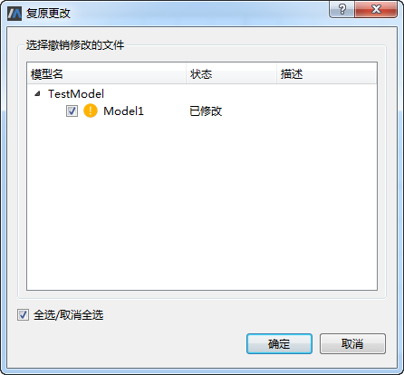

# 复原更改

这里，用户A在模型库TestModel中新增Model1后进行了本地提交操作，接着对Model1进行了修改，若此时想恢复至新增Model1（最新的本地提交版本）时的状态，则鼠标右键单击模型库TestModel中的任意节点选择“复原更改”菜单，弹出“复原更改”对话框。

在“复原更改”对话框中勾选需要撤销修改的模型，这里保持默认全部勾选，点击“确定”按钮，勾选的模型恢复至最新的本地提交状态。

