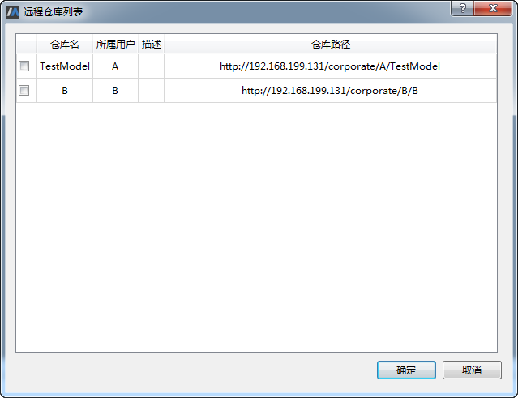
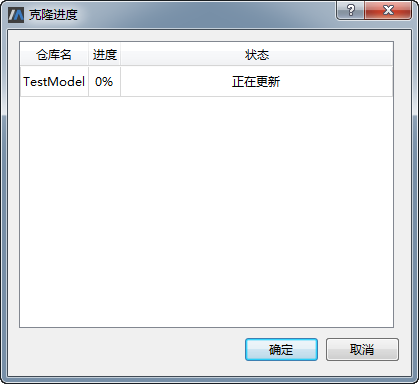
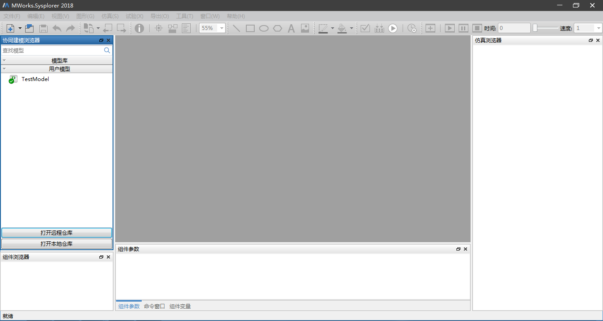
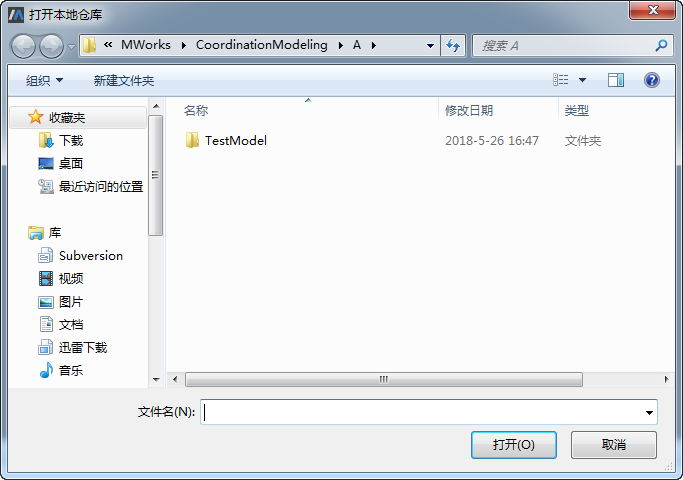

# 克隆远程仓库

## 准备工作

启动SysLink客户端，确保当前处于协同模式。若当前处于单机模式，则点击菜单“工具→选项”，弹出“选项”对话框，切换至“Git”项，在模式切换中点击“协同模式”即可。

## 克隆远程库

点击左侧协同建模浏览器中的“打开远程仓库”按钮，弹出“登录”对话框。

在“登录”对话框中输入用户名和密码，接着点击“确定”按钮，弹出“远程仓库列表”对话框，其列出了当前用户未克隆的所有仓库和协作仓库。

勾选一仓库如“TestModel”，点击“确定”按钮，开始克隆选择的仓库。

克隆完成后，点击“确定”按钮，MWorks自动加载显示克隆至本地的仓库对应的模型TestModel，接着用户就可以在模型上协同工作了。

点击“打开本地仓库”，在弹出的“打开本地仓库”对话框中可以看到克隆至本地的仓库。

