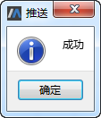

# 推送到服务器

以用户A本地模型库TestModel中编辑模型Model1推送到服务器为例，用户A新增模型Model1进行本地提交后，对Model1进行编辑。

接着鼠标右键单击TestModel中的任意节点选择“推送到服务器”菜单，过一会提示“推送成功”。

推送服务器操作之前会默认进行本地提交操作，将所做修改先提交至本地私有库。

若在用户A推送至服务器之前用户B对TestModel进行了编辑且推送至服务器，且用户A编辑后的内容与用户B存在冲突，则当用户A进行推送至服务器操作时，

