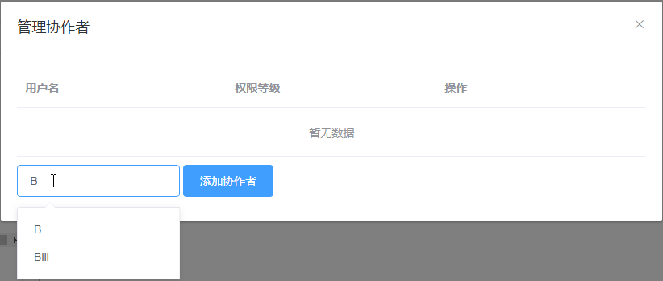
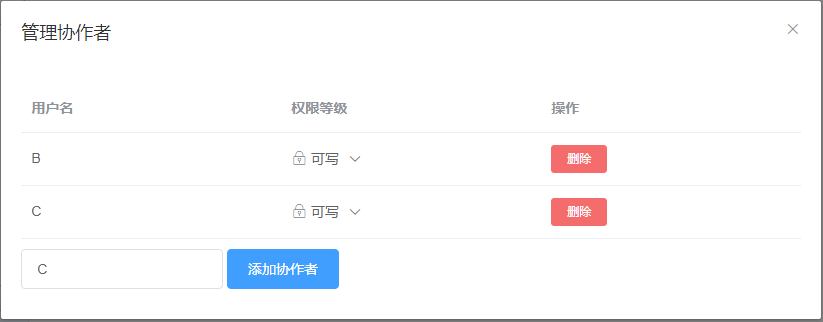
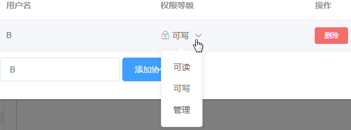

# 添加协作者

新建仓库完成后，在仓库详细信息页面的右侧点击“协作者”按钮，弹出“管理协作者”对话框，当前不存在协作者。

在用户搜索框中输入待查找用户的用户名，这里为用户“B”，下方显示出包含“B”的所有用户名。

选择用户“B”，点击“添加协作者”按钮，则成功将用户“B”添加为当前仓库的协作者，且默认权限为“可写权限”。

若要更改协作者的权限，点击权限下拉框，在显示的权限菜单中选择其他项即可。

若要删除协作者，则点击“删除”按钮，在弹出的是否删除协作者的提示框中点击“确定”按钮，将当前选中的协作者“B”删除。

