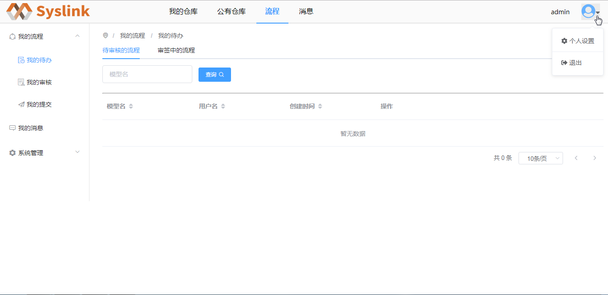
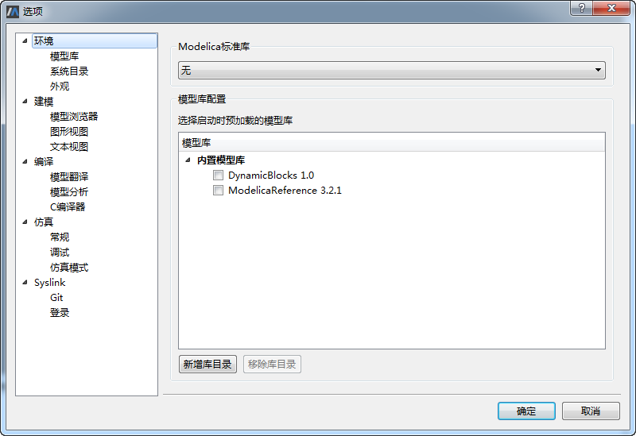

# 身份认证

## SysLink身份认证

普通用户登录SysLink系统与系统管理员是相同的，若要退出系统，点击右上角图标，弹出下拉菜单。

选择“退出”菜单，在弹出的确认退出提示框中，点击“确定”按钮，退出SysLink系统，跳转至系统登录界面；若点击“取消”按钮，则取消当前的退出系统操作。

## SysLink客户端身份认证

初次使用SysLink客户端MWorks时，点击菜单“工具→选项”，弹出“选项”对话框，默认为“环境”项，切换至“Syslink→登录”项。

