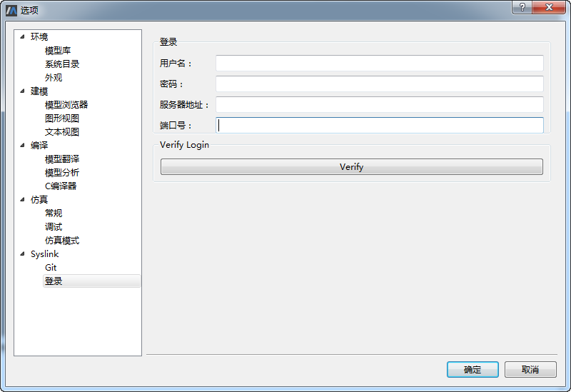
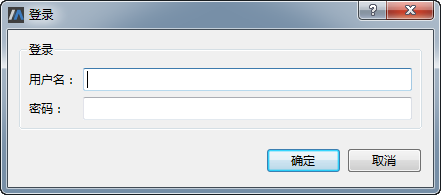

# 身份认证

## SysLink身份认证

普通用户登录SysLink系统与系统管理员是相同的，若要退出系统，点击右上角图标，弹出下拉菜单。

选择“退出”菜单，在弹出的确认退出提示框中，点击“确定”按钮，退出SysLink系统，跳转至系统登录界面；若点击“取消”按钮，则取消当前的退出系统操作。

## SysLink客户端身份认证

初次使用SysLink客户端MWorks时，点击菜单“工具→选项”，弹出“选项”对话框，默认为“环境”项，切换至“Syslink→登录”项。

在右侧输入正确的用户名、密码、服务器地址和端口号，点击“Verify”按钮，提示登录成功，且用户的登录信息被保存。

后面在使用MWorks进行拉取、推送到服务器、本地提交、复原更改和对比变更操作时直接根据保存的登录信息进行验证。但在每次打开Mworks进行打开远程仓库操作时，需要进行身份认证。

