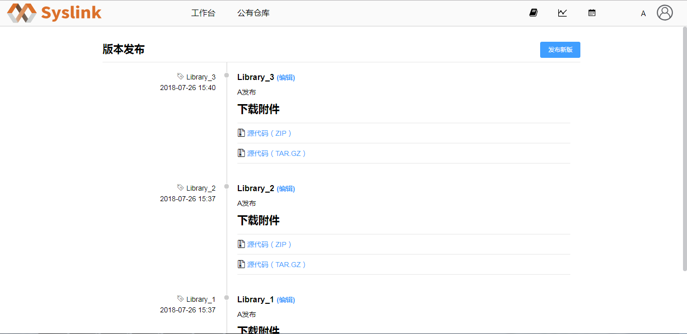

# 版本发布

在“我的仓库”页面，选中一仓库如“TestModel”，接着点击“操作”列对应的“查看”按钮，进入仓库“TestModel”的详细信息页面。

接着点击“版本发布”按钮，进入“版本发布”页面，可以看到已发布的所有版本，支持对已发布版本进行下载。

若要发布当前新版本，则点击“发布新版”按钮，弹出“版本发布”对话框。

在“版本发布”对话框中设置版本的标签、分支、标题和内容，这里设置标签和标题为“TestModel\_2”，接着点击“发布版本”按钮，可以看到新发布的版本信息。

