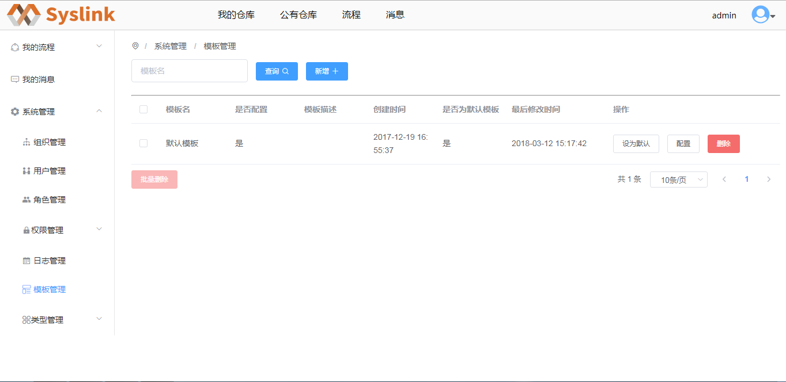
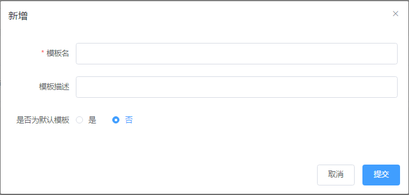
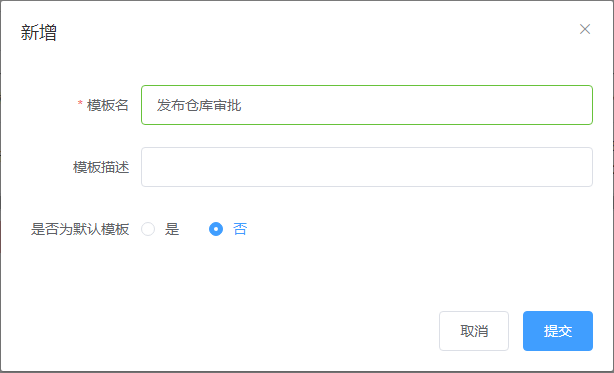
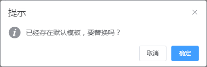

# 审签模板管理

## 新增模板

用户登录SysLink系统后，点击“流程”菜单，接着展开左侧的“系统管理”项。

接着点击“模板管理”项，进入模板管理页面。

系统默认存在一模板“默认模板”，点击“配置”按钮，进入“审核人员配置”页面，可以查看默认模板各节点的人员配置情况。

返回至模板管理页面中点击“新增”按钮，弹出“新增”对话框。

在“新增”对话框中设置新增模板的模板名、描述信息和是否为默认模板，这里设置模板名为“发布仓库审批”，其他项默认。

点击“提交”按钮，提示新增模板成功，在模板列表中可以看到新增的模板信息。

新增模板时若“是否为默认模板”为“是”，则点击“提交”按钮后，弹出替换默认模板的提示框，如下图所示。

点击“确定”按钮，新增一模板“发布仓库审批”且为当前默认模板，否则取消替换当前默认模板的操作。

