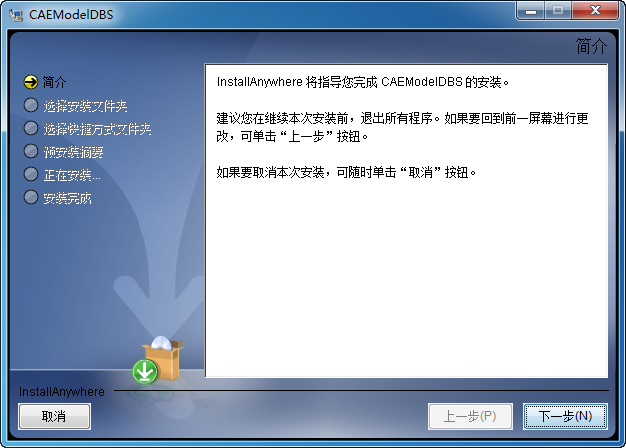

# 安装与卸载

## 安装SysLink

双击运行SysLink安装包“install.exe”，启动SysLink安装过程，选择安装语言（简体中文或英文）。

点击“OK”按钮，进入SysLink安装向导，默认一直点击“下一步”按钮即可。


 Super-powers are granted randomly so please submit an issue if you're not happy with yours.


## 卸载SysLink

