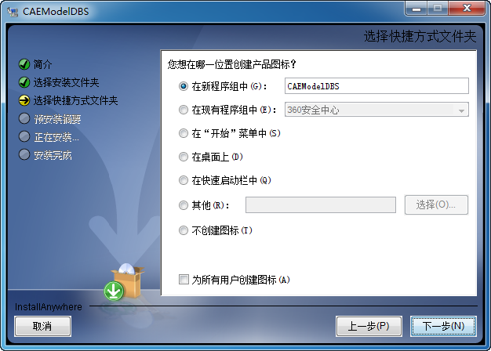
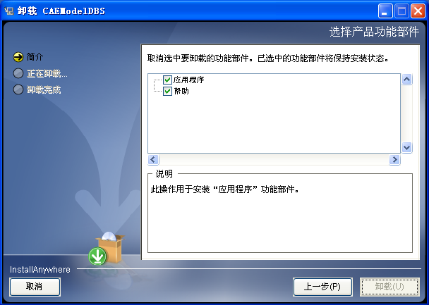

# 安装与卸载SysLink服务器

## 安装SysLink服务器

双击运行SysLink服务器安装包“install.exe”，启动SysLink服务器安装过程：

\(1\). 选择安装语言（简体中文或English）。

\(2\). 点击“OK”按钮，进入SysLink服务器安装向导。

\(3\). 选择安装文件夹。系统缺省设为“C:\Windows\SysWOW64\CAEModelDBS”，如果需安装在其他目录，点击“选择”选择文件夹。

\(4\). 选择快捷方式文件夹，默认在新程序组中创建。

\(5\). 确认安装。

\(6\). 正在安装SysLink服务器。

\(7\). 安装完成。

## 卸载SysLink服务器

SysLink服务器安装后默认安装路径“C:\WINDOWS\SysWOW64\CAEModelDBS\Uninstall\_CAEModelDBS”下存在一卸载程序“Uninstall CAEModelDBS.exe”。

\(1\). 双击“Uninstall CAEModelDBS.exe”，启动SysLink服务器的卸载过程。

\(2\). 选择卸载方式，完全卸载或者卸载特定功能。

* 若选择“完全卸载”，点击“下一步”按钮完全卸载SysLink服务器。

* 若选择“卸载特定功能”，点击“下一步”按钮，取消选中要卸载的功能部件，点击“卸载”按钮卸载取消选中的功能部件。

