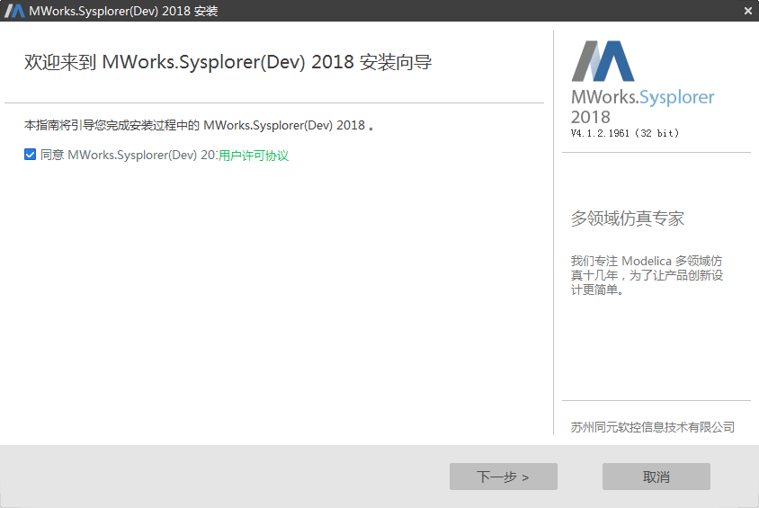
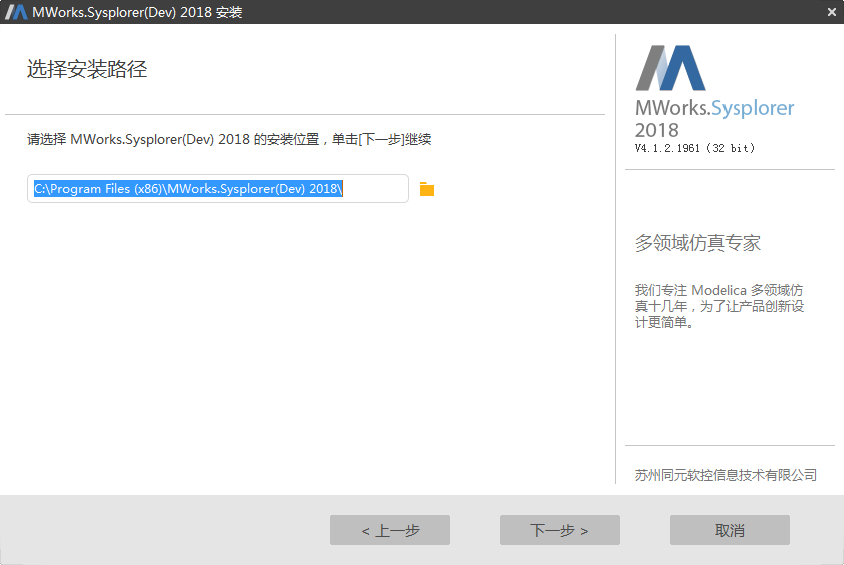
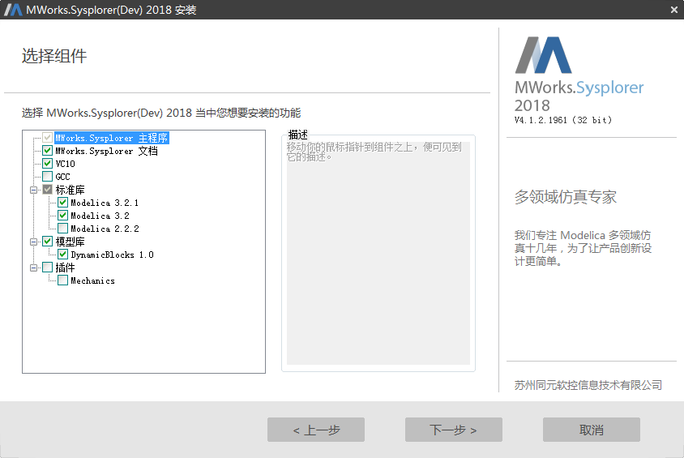
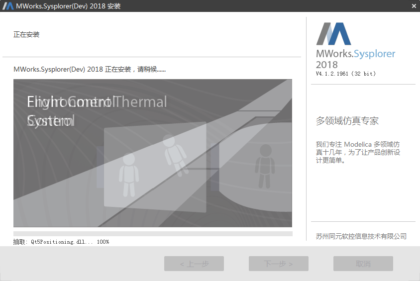
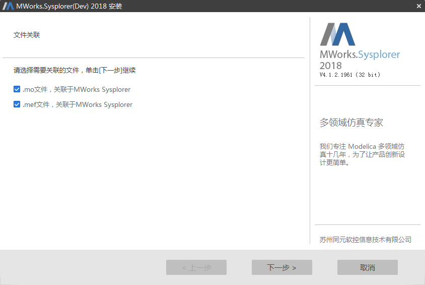
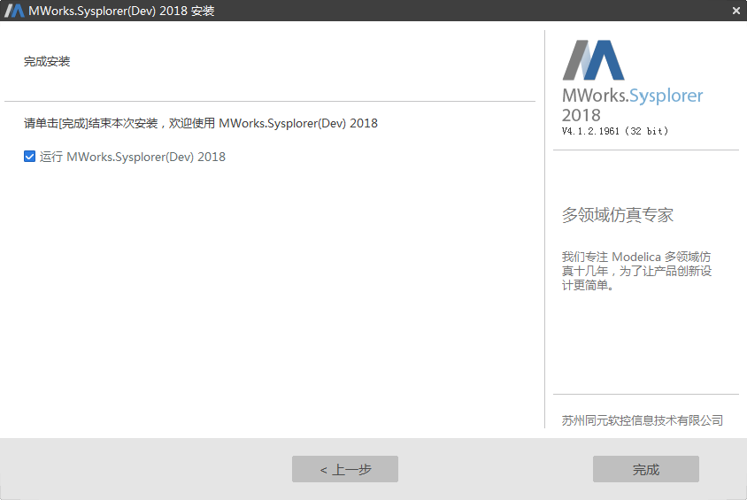

# 安装与卸载SysLink客户端

## 安装SysLink客户端

双击运行SysLink客户端（MWorks.Sysplorer，下面简称为MWorks）安装包“MWorks.Sysplorer 2018\(x86\)\_4.1.2.1961\_Setup\(Dev\).exe”，启动MWorks安装过程：

\(1\). 同意用户许可协议。

\(2\). 选择安装路径。系统缺省设为“C:\Program Files \(x86\)\MWorks.Sysplorer\(Dev\) 2018\”，如果需安装在其他目录，点击 按钮选择文件夹。

\(3\). 选择想要安装的组件。

\(4\). 正在安装MWorks。

\(5\). 选择需要关联的文件。

\(6\). 安装完成。

## 卸载SysLink客户端

### 快捷卸载程序

通过快捷程序卸载MWorks是最简捷的方式。MWorks安装后创建了开始菜单卸载程序的快捷方式。

点击运行“uninstall”，开始卸载MWorks。

