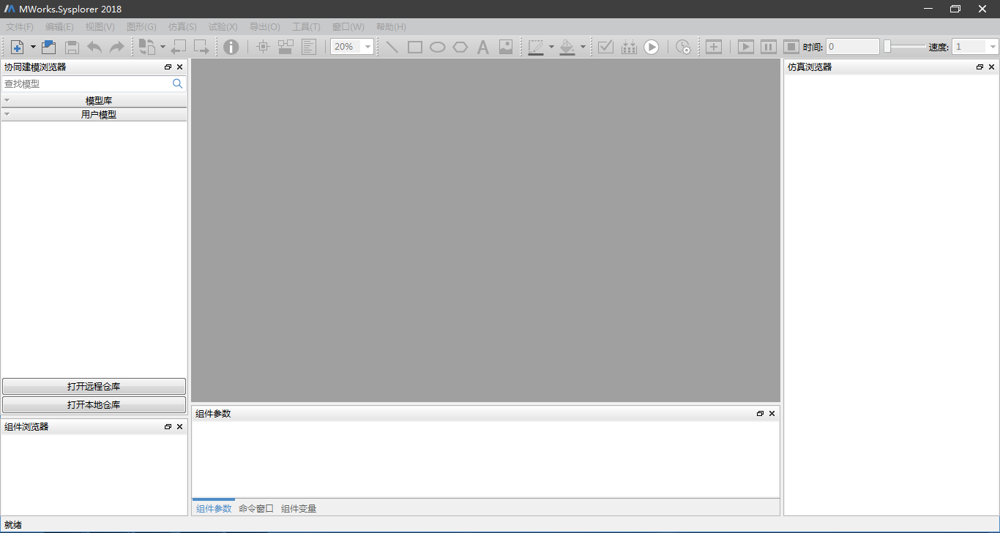

# 运行配置

## SysLink服务器运行配置

\(1\). SysLink服务器安装完成后，打开C:\Windows\SysWOW64\CAEModelDBS\tomcat\webapps\ROOT\WEB-INF\classes\[默认安装路径\]下的application.properties，修改其中的gogsHostPath（位于62行）和HostPath（位于64行）为当前服务器IP。

```text
gogsHostPath = 192.168.52.128:3001

HostPath = 192.168.52.128:8080
```

\(2\). 修改C:\Windows\SysWOW64\CAEModelDBS\tomcat\webapps\ROOT\WEB-INF\classes\static\assets\js\[默认安装路径\]下app.442745aca11fdf64a966.js中的HostPath（位于112111行）为当前服务器IP。

```text
var HostPath = "192.168.52.128";
```

\(3\). 修改C:\Windows\SysWOW64\CAEModelDBS\tomcat\webapps\ROOT\WEB-INF\classes\static\assets\js\[默认安装路径\]下app.442745aca11fdf64a966.js.map中的HostPath为当前服务器IP。

```text
const HostPath = \"192.168.52.128\"\r\n
```

\(4\). 首次启动SysLink服务器时需要对数据库mysql进行配置，运行开始菜单“CAEModelDBS”下的update.bat即可。

\(5\). 接着或者非首次启动SysLink服务器，运行开始菜单“CAEModelDBS”下的nginx.exe启动nginx服务器，接着运行Startup.bat启动tomcat服务器。


\(6\). 接着在浏览器中输入“syslink.com”，按下Enter键启动SysLink web端登录界面。


## SysLink客户端运行配置

双击桌面上的快捷方式MWorks，即启动SysLink客户端。




