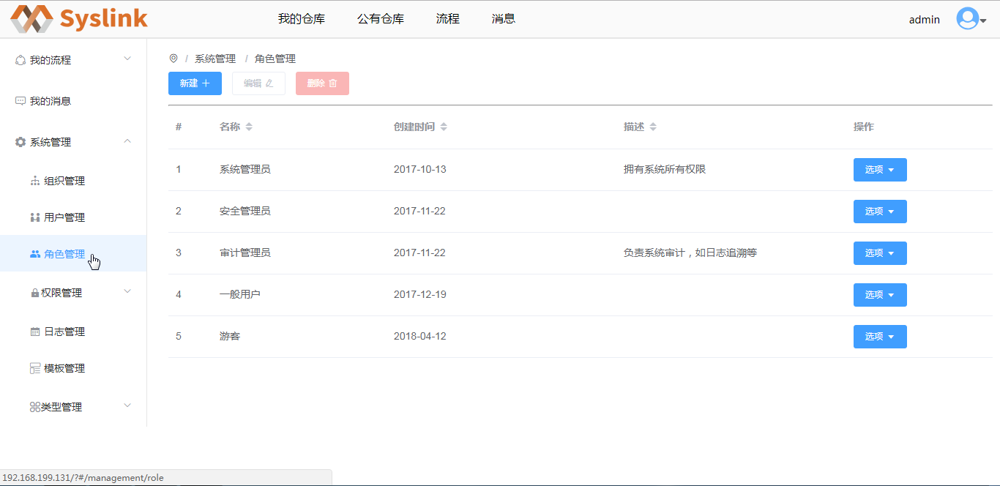

# 角色管理

## 创建角色

在展开的“系统管理”项中点击“角色管理”项，进入“角色管理”页面，可以在右侧可以查看系统的角色列表信息。

接着点击“新建”按钮，弹出“新建角色”对话框。

在“新建角色”对话框中设置角色名称和描述等信息，这里设置角色名称如为“权限管理员”，“描述”为“负责权限授予等”。

点击“提交”按钮，提示创建角色成功，在系统角色列表中可看到新创建的角色信息。

## 编辑角色

在系统角色列表中选中一个角色如新建的“权限管理员”，接着点击“编辑”按钮，弹出“编辑角色”对话框。

