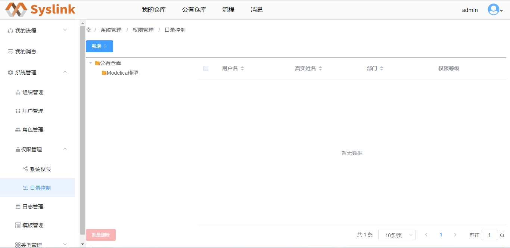
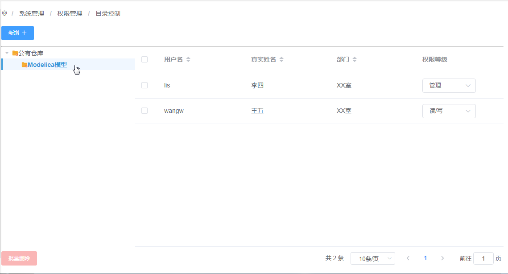
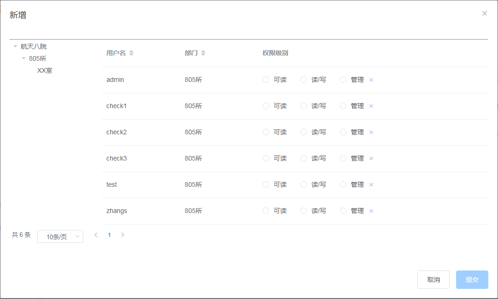
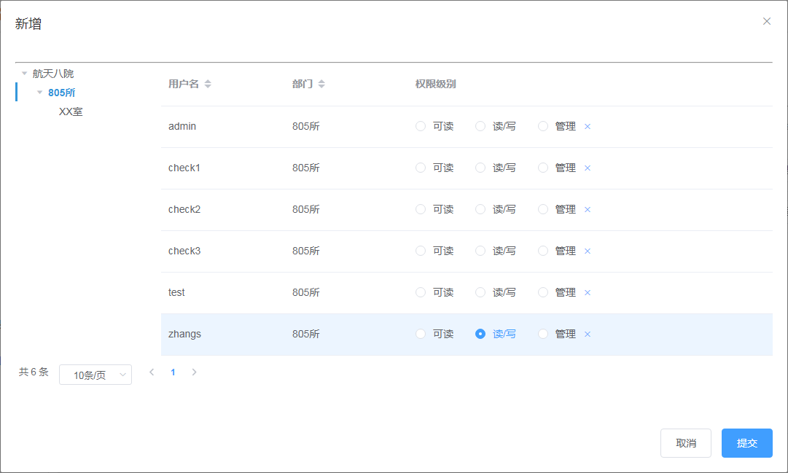
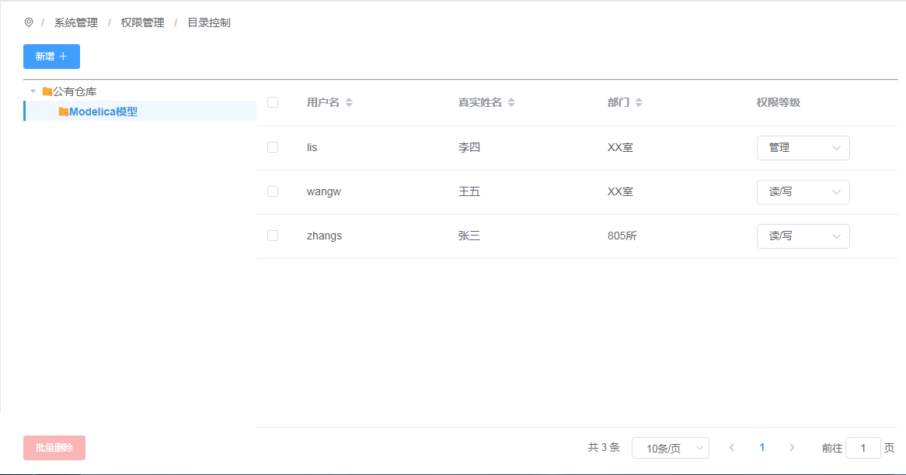
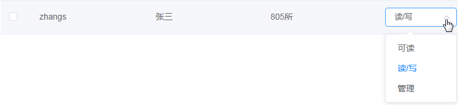

# 目录控制权限管理

## 新增目录控制

对选中的公有仓库分类目录新增具有控制权限的用户。

在展开的“权限管理”项中点击“目录控制”项，进入“目录控制”页面。

在左侧公有模型目录树上选中一目录如“Modelica模型”，则在右侧显示对选中目录具有控制权限的用户列表和控制权限信息。

接着点击“新增”按钮，弹出“新增”对话框。

在“新增”对话框左侧的部门树上选中一部门，接着在右侧选择对选中目录具有控制权限的用户以及赋予其控制权限，如这里设置“zhangs”的权限级别为“读/写”。

接着点击“提交”按钮，在选中的公有模型目录下看到新增一用户“zhangs”，且其权限级别为“读/写”。

## 编辑目录控制

编辑对选中公有仓库分类目录具有控制权限的用户的控制权限。

在“Modelica模型”目录的用户列表中选中一用户如“zhangs”，点击“权限等级”列对应的下拉标志，在弹出的下拉选项中设置权限等级。

## 删除目录控制

在 “Modelica模型”目录的用户列表中选中若干用户，接着点击“批量删除”按钮，弹出删除确认框。

点击“确定”按钮，则选中的用户不再具有对选中目录的控制权限；点击“取消”按钮，则取消对选中用户的删除操作。

