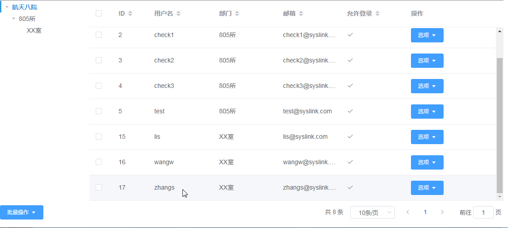

# 用户管理

## 创建用户

在展开的“系统管理”项中点击“用户管理”项，进入“用户管理”页面，可以在右侧查看用户列表信息。

在“用户管理”页面左侧部门树上选中一部门如“XX室”，则在右侧可以看到选中部门下的人员列表。

点击“新增”按钮，弹出“新增”对话框。

在“新增”对话框中设置用户的用户名、真实姓名、密码、邮箱、部门和角色等信息，其中带\*项为必填项。这里设置用户名如为“zhangs”，真实姓名为“张三”，邮箱为“zhans@syslink.com”，部门为“XX室”，角色为“一般用户”，设置密码和确认密码。若密码选择为空，则默认为“111111”。

点击“提交”按钮，提示添加用户成功，接着在人员列表中可看到新创建的用户信息。

## 编辑用户

对选中的用户进行编辑操作，包括部门、真实姓名、邮箱、密码和是否禁止登录等信息。

在人员列表中选中一个用户如新增的“zhangs”，接着在“操作”列对应的“选项”下拉菜单中选择“编辑”，弹出“编辑用户信息”对话框。

在“编辑用户信息”对话框中修改选中用户的部门、真实名称、邮箱、密码和是否被禁止等信息，如这里将部门设置为“805所”。

点击“提交”按钮，提示编辑用户成功。接着在人员列表中可看到用户“zhangs”编辑后的信息，如下图所示。

## 删除用户

在人员列表中，选中一个用户如新增的“zhangs”，接着在“操作”列对应的“选项”下拉菜单中选择“删除”，弹出是否删除用户的确认框。

点击“确认”按钮，删除选中的用户；点击“取消”按钮，取消人员的删除操作。

## 编辑个人角色

在人员列表中选中一用户如“zhangs”，接着在“操作”列对应的“选项”下拉菜单中选择“分配角色”，弹出“分配角色”窗口。

“分配角色”对话框右侧为选中用户当前拥有的角色，将角色从左侧移至右侧表示加角色，从右侧移至左侧表示减角色。这里以给用户“zhangs”添加“安全管理员”的角色为例，勾选左侧的“安全管理员”角色，接着点击“分配”按钮，则选中的角色移至右侧。

若要删除该角色，则在右侧将其勾选，点击“移除”按钮即可。

系统同时支持勾选多个用户后，点击下方“批量操作”下拉菜单中的“分配角色”，对多个用户进行角色分配操作。

## 编辑个人权限

在人员列表中选中一用户，这里仍以“zhangs”为例。在“操作”列对应的“选项”下拉菜单中选择“分配权限”，弹出“分配权限”对话框。在“分配权限”对话框中勾选/取消勾选一权限，则选中用户拥有或者取消拥有该权限。

系统同时支持勾选多个用户后，点击下方“批量操作”下拉菜单中的“分配权限”，对多个用户进行权限分配操作。

