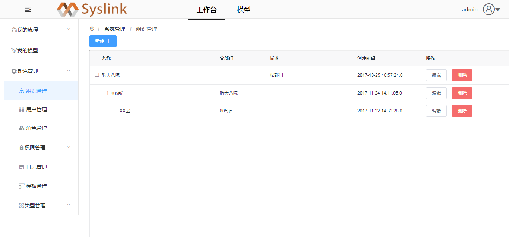
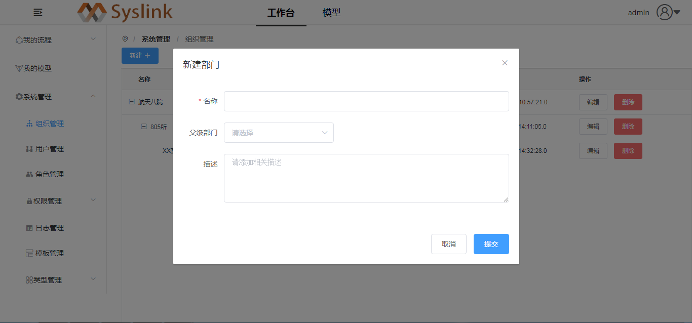
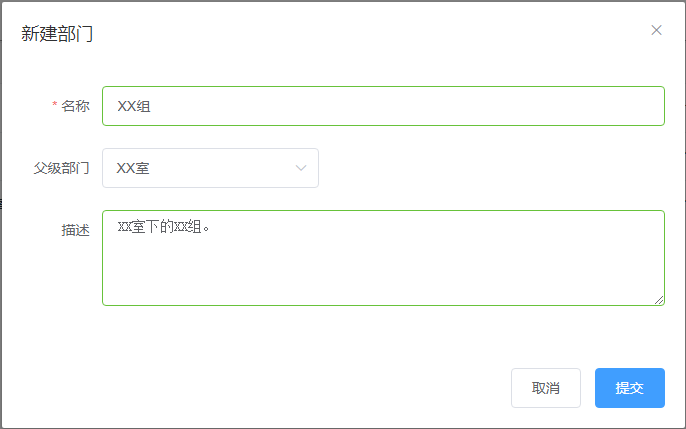
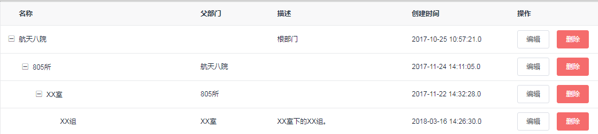

# 部门管理

## 新建部门

系统管理员登录SysLink系统后，点击“流程”菜单，接着展开左侧的“系统管理”项。

点击“组织管理”项，进入到“组织管理”页面，可以在右侧查看组织列表信息。

点击“新建”按钮，弹出“新建部门”对话框，如下图所示。

这里在“名称”项中输入如“805所”，在父级部门的下拉框中选择父级部门如为“XX室”，接着填写描述信息。

点击“提交”按钮，在部门列表中可查看到新创建的部门“XX组”。

