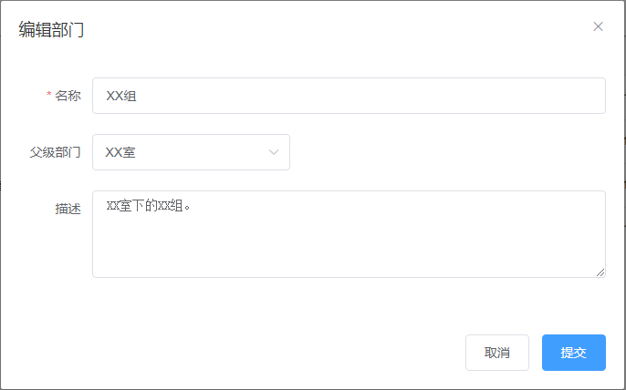
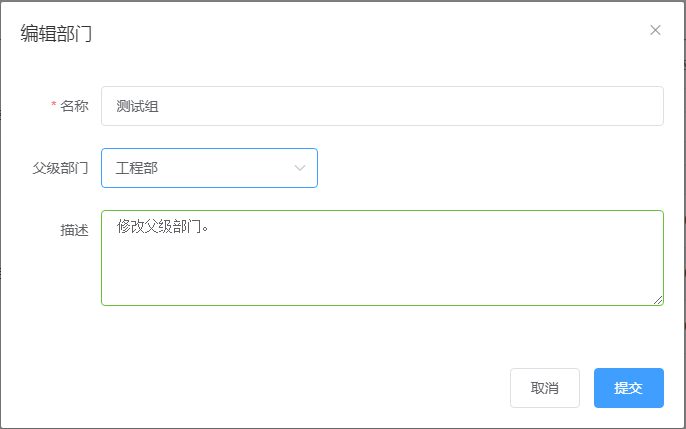
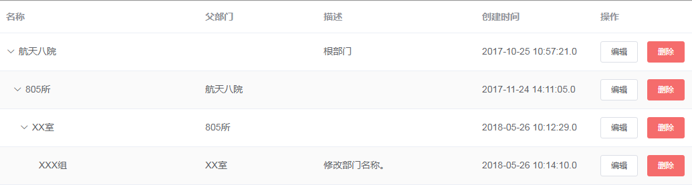

# 部门管理

## 新建部门

系统管理员登录SysLink系统后，点击“流程”菜单，接着展开左侧的“系统管理”项。

点击“组织管理”项，进入到“组织管理”页面，可以在右侧查看组织列表信息。

点击“新建”按钮，弹出“新建部门”对话框，如下图所示。

这里在“名称”项中输入如“805所”，在父级部门的下拉框中选择父级部门如为“XX室”，接着填写描述信息。

点击“提交”按钮，在部门列表中可查看到新创建的部门“XX组”。

## 编辑部门

在部门列表中选中一个部门如新建的“XX组”，接着点击“编辑”按钮，弹出“编辑部门”对话框。

在“编辑部门”对话框中编辑部门名称、父级部门和描述项，这里将部门名称修改为“XXX组”，“描述”中输入“修改部门名称。”。

点击“提交”按钮，在部门列表中可查看到编辑后的部门“XXX组”。

## 删除部门

在部门列表中，选中一个部门如编辑后的“XXX组”，点击“删除”按钮，弹出删除部门确认框。

点击“确定“按钮，选中的部门从部门列表中删除。若部门中存在人员，则随着部门也一并删除。

若删除的部门为父级部门，则其隶属部门及隶属部门人员也将删除。其中，根部门为系统默认部门，不允许被删除。

